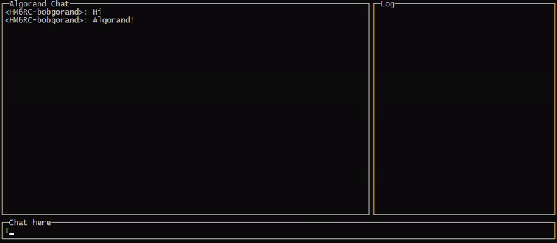

# Algochat 

Algochat is an app that uses Algorand blockchain to implement a public chat service. 

It's not an official recommendation about making dapps mounted on Algorand, just a funny project to try the SDK and play around with the _note_ field which can hold arbitrary byte data. Dirty, non-production ready, only a PoC!

# Use
At the current moment, it works in the TestNet, so if you have an account with Algos you're ready to go.

```
$ go run main.go -h
Usage of main:
  -algodaddress string
        algod.net address (default "http://localhost:8080")
  -algodtoken string
        algod.token value
  -from string
        the addr of the wallet from which you will pay the txn fees
  -kmdaddress string
        kmd.net address (default "http://localhost:7833")
  -kmdtoken string
        kmd.token value
  -username string
        username to use in the chat (default "Guest")
  -wallet string
        the name of the wallet to use
  -walletpassword string
        the password of the wallet
```

For example:
```
$ go run main.go -wallet funnywallet -walletpassword funnypassword123 -from <from-addr-from-your-wallet> -algodtoken <algod.token> -kmdtoken <kmd.token> -username bobgorand
```

You'll see all the chat messages in the last 1000 blocks, and you can immediately start chatting.

Here a 20s demo:


Check the logs to see what's happening.

## Random notes
* Whenever a user sends a message to the chatroom it gets marshaled in the _note_ field of the transaction. 
* Every transaction with the destination address _KPLD4GPZYXST7S2ALYSAVRCBWYBCUQCN6T4N6HAYCHCP4GOV7KWJUGITBE_ is considered a message of the app.
* Every message also shows the first 5 sringified characters of the address that sent the message as a prefix of the username.
* The message is JSON encoded. Considering the _note_ field size limitation, a more efficient encoding like protobufs would be more convenient.
* The transaction corresponding to each message sends 0 algos to the chat address and uses the suggested fee from the SDK.
* When you open the chat it will show the messages contained in the last 1000 blocks. Originally I wanted this to be parametrizable, but since the default node is non-archival it doesn't make much sense. 1000  blocks ~ 1-hour approx.
* The SDK allows sending the transaction only asynchronously. After the transaction is submitted, the program scans the pending transactions until the sent transactionID is out of the pool, then considers the transaction confirmed (... not 100% true).
* Ctrl+C will close the program immediately. The code doesn't worry about finishing goroutines gracefully.
* Everything you see in the _Algorand Chat_ window is exclusively confirmed on-chain. I intentionally avoided _cheating_ showing new messages as soon as is submitted (before real confirmation). In a production chat service we'd intentionally do the opposite, display it right away with some UX signals (async).

## Seems to be a good idea
* Event notifications _natively_ from the SDK, e.g, a new block has arrived.
* Synchronous transaction sending or confirmation callbacks.
* The SDK is a wrapper of the node REST API. Consider having gRPC endpoint on the node, might allow much powerful APIs? (use of streams for events, faster calls, less mem, etc).
